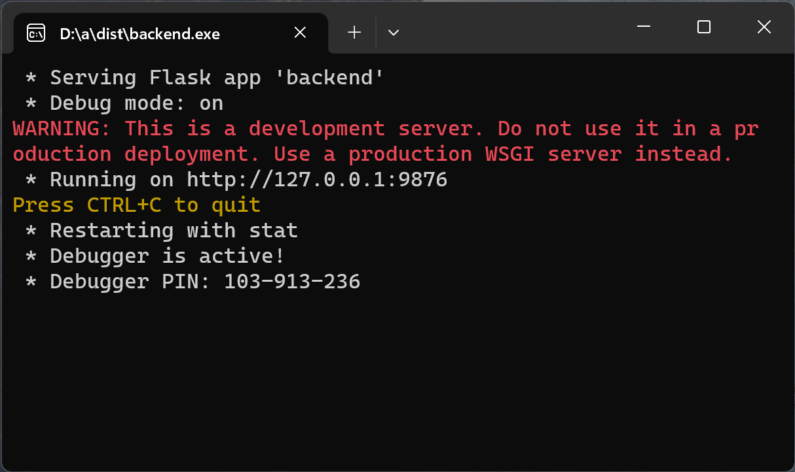
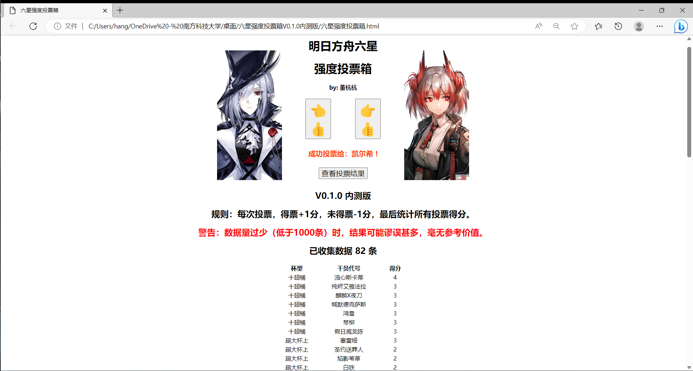

# Arknights_6Star_Rank_Vote
明日方舟 六星干员强度投票箱

依据血狼破军直播提供的大众投票强度榜设计思路 (https://b23.tv/hdq47zw 10分40秒) 编写的强度投票程序，供明日方舟玩家投票、看榜、找乐子。

## 部署方式

本程序按照原本设计，用户直接用浏览器打开网页即可访问。但我现在没有服务器，所以暂时需要用户在本地电脑上部署后端程序。（建议使用Windows系统）

1.下载 “deploy 本地部署后端体验版”

2.双击运行 “backend.exe”，运行后应当弹出一个不会自动关闭的命令行窗口，如下图所示：

3.下载 “六星干员强度投票箱.html”

4.双击打开 “六星干员强度投票箱.html”

## 使用说明

本程序使用Python Flask后端，JavaScript前端编写，界面如下图所示：

### 计分规则

如图所示，从所有6星干员中，随机抽取两位，供用户投票强弱。你可以点击你认为较强的干员，旁边的按钮，为其投票。

每次投票，得票的干员+1分，未得票的干员-1分。当投票次数足够多时，可以认为所有干员之间都得到了较充分的比较。

最后，统计所有投票得分，得分较高者，排名也较高。

### 结果展示

每次的投票结果数据，投票后将立刻写入服务端电脑，存储为txt文档。

点击 __查看投票结果__ 按钮，将根据现有全部数据和上述规则，实时生成排行榜。

特别要注意的是，当数据量很少时，由于随机抽取轮到每位干员的次数不等，且较小群体的主观认知偏见较大，此时生成的排名结果质量很差，谬误甚多，完全不能反映干员的真实水平。

即使数据量较大，此种排名也并不精确，最终结果受随机分组的影响较大。因此，这个榜单不会精确到每一名，而是按照明日方舟的惯例“超大杯、大杯、中杯”进行排名。我认为争论谁是倒数第几名，是不太友善的行为，因此中杯将不区分“上、中、下”三个小档。

## 版权及鸣谢

本程序内使用的游戏图片、文本等信息，其版权属于 Arknights/上海鹰角网络科技有限公司。

此外，在数据爬取和信息展示中，得到了PRTS.wiki的支持，在此表示感谢！
